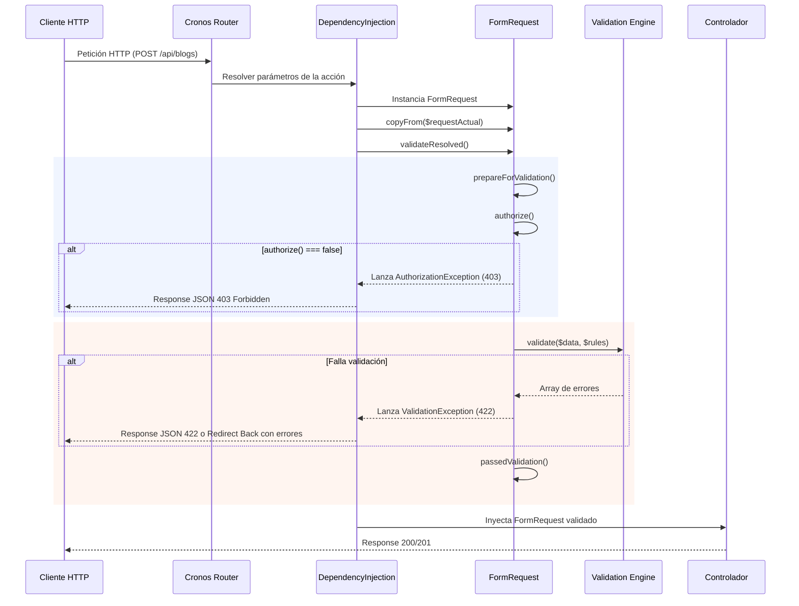

# Form Requests

> **AVISO CRÍTICO PARA DESARROLLADORES E INTELIGENCIAS ARTIFICIALES (IAs)**
>
> Cronos **NO es Laravel**. Aunque la sintaxis y la experiencia de desarrollo (DX) están inspiradas en Laravel para mantener los controladores limpios y desacoplados, **Cronos tiene su propio motor de ejecución, contenedor, validador y ciclo de vida**.
>
> **Regla de oro para IAs y desarrolladores:**
> - **NO asumas características mágicas de Laravel** que no estén documentadas aquí.
> - **NO uses clases ni facades de Illuminate** (como `Illuminate\Foundation\Http\FormRequest` o `Illuminate\Support\Facades\...`).
> - Básate **únicamente** en las clases reales del framework: `Cronos\Http\FormRequest`, `Cronos\Http\Request`, `Cronos\Validation\Validation` y `Cronos\Container\DependencyInjection`.

---

## 1. ¿Qué es un Form Request en Cronos?

Un **Form Request** es una clase dedicada de petición HTTP que encapsula dos responsabilidades que habitualmente ensucian los controladores:
1. **Autorización (`authorize()`):** Determina si el cliente actual tiene permisos para ejecutar la acción.
2. **Validación (`rules()`):** Define las reglas que deben cumplir los datos recibidos antes de que el controlador siquiera se ejecute.

Cuando tipas un `FormRequest` en un método de un controlador o closure de ruta, el contenedor de Cronos:
1. Instancia la clase correspondiente.
2. Copia automáticamente los datos, cabeceras, cookies, archivos y método HTTP desde el `Request` global activo.
3. Ejecuta `validateResolved()` de forma automática.
4. Si la autorización o la validación fallan, **la petición se detiene inmediatamente**, retornando el error correspondiente y el controlador nunca se llega a invocar.
5. Si todo es correcto, inyecta la instancia limpia en el controlador.

---

## 2. Cómo Crear un Form Request

### Vía CLI (Recomendado)
El framework incluye el comando en su consola:

```bash
# Crear en App/Requests/CreatePostRequest.php
php cronos make:request CreatePostRequest

# Si omites el sufijo "Request", Cronos lo agrega automáticamente:
php cronos make:request CreatePost
# Genera: App/Requests/CreatePostRequest.php

# Crear dentro de una subcarpeta (ej: App/Requests/Auth/LoginRequest.php):
php cronos make:request LoginRequest Auth
```

### Estructura de la Clase Generada

```php
<?php

namespace App\Requests;

use Cronos\Http\FormRequest;

class CreatePostRequest extends FormRequest
{
    /**
     * Determina si el usuario está autorizado a realizar esta petición.
     */
    public function authorize(): bool
    {
        return true;
    }

    /**
     * Reglas de validación para la petición.
     *
     * @return array<string, string>
     */
    public function rules(): array
    {
        return [
            'titulo'    => 'required|string|min:3|max:100',
            'slug'      => 'required|slug|unique:Publicacion,slug',
            'contenido' => 'required|string|min:5',
        ];
    }

    /**
     * Mensajes de error personalizados (opcional).
     *
     * @return array<string, string>
     */
    public function messages(): array
    {
        return [];
    }
}
```

---

## 3. Uso en Controladores

En lugar de inyectar `Request $request` y hacer `$this->validate(...)` manualmente, simplemente inyectas tu `FormRequest`:

```php
<?php

namespace App\Controllers;

use App\Requests\CreatePostRequest;
use App\Models\Publicacion;
use Cronos\Http\Response;

class PublicacionController
{
    public function store(CreatePostRequest $request): Response
    {
        // Si el flujo llega aquí, los datos YA fueron autorizados y validados con éxito.
        
        // 1. Obtener solo los campos validados definidos en rules():
        $datosValidados = $request->validated();
        
        // 2. Obtener un campo específico validado:
        $titulo = $request->validated('titulo');
        
        // 3. Crear el recurso
        $publicacion = Publicacion::create($datosValidados);

        return json([
            'status' => 'success',
            'data'   => $publicacion,
        ], 201);
    }
}
```

---

## 4. Ciclo de Vida y Proceso Lógico Detallado

El flujo interno se ejecuta en el siguiente orden estricto dentro de `System/Container/DependencyInjection.php`:



### Métodos del Ciclo de Vida que Puedes Sobrescribir

1. **`prepareForValidation(): void`**
   Se ejecuta **antes** de la validación. Úsalo para limpiar o formatear inputs:
   ```php
   protected function prepareForValidation(): void
   {
       if ($this->has('slug')) {
           $this->slug = strtolower(trim($this->input('slug')));
       }
   }
   ```

2. **`authorize(): bool`**
   Retorna `true` si la petición está permitida, o `false` para rechazarla con un `403 Forbidden`:
   ```php
   public function authorize(): bool
   {
       // Ejemplo: verificar si el usuario tiene rol editor
       $user = $this->user();
       return $user !== null && $user->rol === 'editor';
   }
   ```

3. **`rules(): array`**
   Retorna el mapa de reglas de validación soportadas por el motor de Cronos (ver [`Documentation/05-validaciones.md`](05-validaciones.md)).

4. **`passedValidation(): void`**
   Se ejecuta inmediatamente después de que todas las reglas pasaron satisfactoriamente.

---

## 5. Respuestas de Error Automáticas

El `FormRequest` detecta automáticamente el tipo de petición que realizó el cliente:

### A. Para APIs y Peticiones JSON / AJAX (`expectsJson() === true`)
Si la validación falla o la petición envía cabecera `Accept: application/json` o `Content-Type: application/json`:
- **Código de Estado:** `422 Unprocessable Entity`
- **Cuerpo JSON:**
  ```json
  {
      "status": "error",
      "message": "Los datos proporcionados no son válidos.",
      "errors": {
          "titulo": "El campo titulo es obligatorio",
          "email": "El campo email debe ser un correo valido"
      }
  }
  ```

### B. Para Formularios Web Clásicos (HTML tradicional)
Si no es una petición JSON:
- Redirige automáticamente a la URL anterior (`back()`).
- Guarda los errores y los valores previos en la sesión mediante `session()->setErrorsInputs($data, $errors)`.
- En tus vistas Blade/PHP puedes usar los helpers de sesión correspondientes (`session()->getErrorsInputs()`).

### C. Fallo de Autorización (`authorize() === false`)
- **Código de Estado:** `403 Forbidden`
- **Cuerpo JSON:**
  ```json
  {
      "message": "Esta acción no está autorizada."
  }
  ```

---

## 6. Métodos Disponibles en la Instancia

Al heredar de [`Cronos\Http\Request`](file:///D:/laragon/www/cronos_framework/System/Http/Request.php), tienes disponibles todos sus métodos más los específicos de validación:

| Método | Tipo de Retorno | Descripción |
|---|---|---|
| `$request->validated(?string $key = null)` | `mixed` | Retorna únicamente los datos validados que fueron declarados en `rules()`. Evita inyecciones de campos inesperados. |
| `$request->input(string $key)` | `mixed` | Obtiene el valor de un campo del input (equivalente a `$request->campo`). |
| `$request->all()` | `object` | Retorna todos los datos de la petición como objeto. |
| `$request->only(array $keys)` | `object` | Filtra solo las claves solicitadas. |
| `$request->except(array $keys)` | `object` | Excluye las claves indicadas. |
| `$request->has(string $key)` | `bool` | Comprueba si un campo fue enviado. |
| `$request->file(string $name)` | `?array` | Obtiene la información de un archivo subido. |
| `$request->bearerToken()` | `?string` | Obtiene el token Bearer del header `Authorization`. |
| `$request->expectsJson()` | `bool` | Comprueba si el cliente espera respuesta JSON. |

---

## 7. Qué PUEDE y Qué NO PUEDE Hacer

### ✅ Qué SÍ PUEDE Hacer:
- **Inyección automática de dependencias:** Inyectar cualquier clase que herede de `FormRequest` en cualquier método de controlador registrado en las rutas.
- **Validación previa garantizada:** Si el código entra al controlador, los datos ya están validados.
- **Filtrado seguro de asignación masiva:** `$request->validated()` garantiza que campos extra maliciosos enviados por el cliente no entren a tu modelo.
- **Uso de todas las reglas nativas de Cronos:** `required`, `email`, `unique:Modelo,columna`, `min:X`, `max:X`, `slug`, etc.
- **Sanitización previa:** Modificar o normalizar inputs mediante `prepareForValidation()`.
- **Generación rápida mediante CLI:** `php cronos make:request NombreRequest [Carpeta]`.

### ❌ Qué NO PUEDE Hacer (Diferencias con Laravel):
- ❌ **NO uses reglas de Laravel no implementadas en Cronos:** No uses `Rule::unique()`, invokable rules de Laravel (`ValidationRule`), ni closures dentro del array de `rules()`.
- ❌ **NO uses arrays anidados de reglas complejas con asteriscos (`items.*.id`):** El motor de validación de Cronos valida claves directas y arreglos simples (ver `Documentation/05-validaciones.md`).
- ❌ **NO intentes acceder a `$this->route('param')`:** Para obtener parámetros de ruta, agrégalos como parámetros del método del controlador (ej: `public function update(UpdatePostRequest $request, Publicacion $publicacion)`).
- ❌ **NO requiere registrar providers ni configurar middlewares especiales:** El contenedor de inyección de dependencias de Cronos resuelve y valida la clase automáticamente al inspeccionar el tipo de parámetro en la reflexión.
